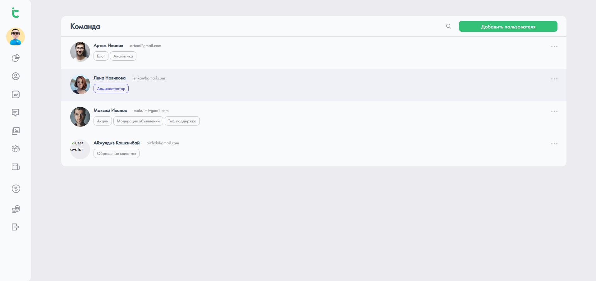

# 🗓️ Calendar Dashboard

Данный проект был создан в рамках тестового задания.

📋 Задачи

Сверстать Dashboard, в которой открыта вкладка «Команда».

Реализовать возможность:
- ➕ добавлять участника,
- 🗑️ удалять участника,
- 🔁 изменять роль участника.

Все компоненты созданы без использования UI-kit, только нативный React и CSS.

---

## 🚀 Технологии

---

## 📁 Структура проекта

src/
 ├── components/      # Компоненты интерфейса (TeamList, AddMemberForm и т.д.)
 ├── store/           # Zustand store (управление состоянием)
 ├── App.js           # Основной компонент приложения
 ├── index.js         # Точка входа
 └── index.css        # Глобальные стили

---

## 🧰 Команды

| Команда | Назначение |
|----------|------------|
| `npm install` | Установка зависимостей |
| `npm start` | Запуск локального сервера |

---

## 🧩 Превью интерфейса

---

## ✨ Автор

**Лугинов Дьулустаан**  
Frontend Developer 
📫 Telegram: [@JulustaanL](https://t.me/JulustaanL)

---